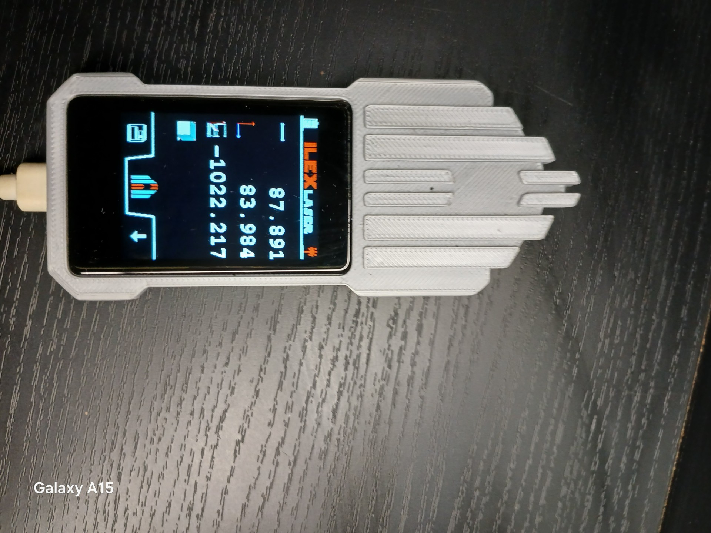

# 🚀 ESP32_TFT_lib

**Bibliothèque C++ légère et orientée objet pour créer des interfaces graphiques (GUI) sur écrans TFT avec ESP32 / ESP32-S3.**  
Développée from-scratch pour mes prototypes embarqués : robots, domotique, dashboards, horloges tactiles, menus interactifs, etc. :contentReference[oaicite:2]{index=2}

---

## 📌 Fonctionnalités principales

Cette bibliothèque fournit :

- 🎨 **Widgets modulaires** : boutons (abstraits & images), textes, images, conteneurs  
- 📱 **Gestion de scènes multiples** avec un gestionnaire centralisé  
- 🔄 **Animations fluides et transitions** entre interfaces  
- ⏱️ **Timers et signaux internes** pour synchronisation d’animations/événements  
- 🧠 **Approche orientée objet** extensible (héritage, composition)  
- 🪶 Compatible tactile : conçu pour fonctionner avec des contrôleurs comme **CST816S** (I²C), écrans ronds GC9A01, LilyGO T-Display S3 Touch, Waveshare, etc. :contentReference[oaicite:3]{index=3}

⚠️ **Dépendance :** nécessite un pilote bas-niveau pour le rendu des pixels (`TFT_eSPI`).

---
